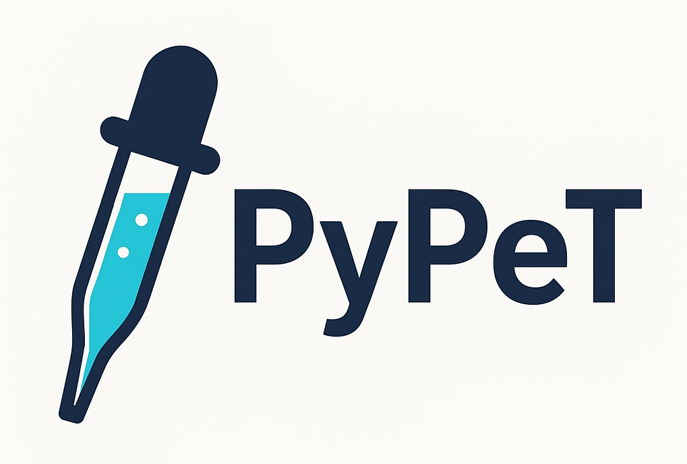

<div align="center">
  
</div>

## Introduction

This repository contains PyPeT (Python Perfusion Tool): a open Python tool for generating perfusion maps from head CTP scans using deconvolution methods. See the attached arXiv paper for an in-depth description of the processing steps and visual comparisons with a FDA-approved tools.

**DISCLAIMER**: This algorithm has **not been formally validated** and is **not intended for clinical use**.

## Data Structure

This tool expects input data to follow a specific directory structure format. The expected structure is demonstrated in the `demo_data` folder:

```
data/
├── sub-<subject_id>/
│   └── ses-<session_id>/
│       ├── sub-<subject_id>_ses-<session_id>_ctp.nii.gz     # Raw CTP data (4D volume)
│       ├── brain_mask.nii.gz                                # (Optional) Brain mask
│       └── perfusion-maps/                                  # (Optional) Reference perfusion maps
│           ├── sub-<subject_id>_ses-<session_id>_cbf.nii.gz # Cerebral Blood Flow
│           ├── sub-<subject_id>_ses-<session_id>_cbv.nii.gz # Cerebral Blood Volume
│           ├── sub-<subject_id>_ses-<session_id>_mtt.nii.gz # Mean Transit Time
│           └── sub-<subject_id>_ses-<session_id>_tmax.nii.gz # Time to Maximum
```

This tool can either generate brain masks using a thresholding and fast-marching approach, or you may provide your own brain mask.

## Citation

If you use this tool, please cite: "PyPeT: A Python Tool for Automated Quantitative Brain CT Perfusion Analysis and Visualization" [insert arXiv DOI]

## References

This work was based on the tutorial by https://github.com/turtleizzy/ctp_csvd

The cSVD deconvolution algorithm was implemented based on:
- https://github.com/SethLirette/CTP 
- https://github.com/marcocastellaro/dsc-mri-toolbox
- Zanderigo F, Bertoldo A, Pillonetto G, Cobelli C. Nonlinear stochastic regularization to characterize tissue residue function in bolus-tracking MRI: assessment and comparison with SVD, block-circulant SVD, and Tikhonov. IEEE Trans Biomed Eng. 2009;56(5):1287-97. doi: 10.1109/TBME.2009.2013820.
