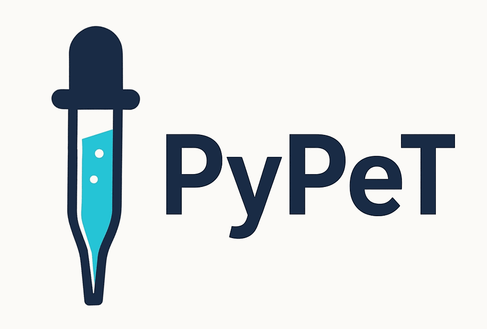
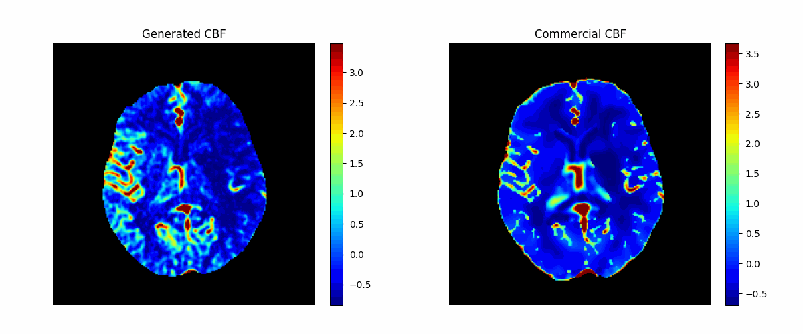

<div align="center">
  
</div>

# PyPeT: an open Python Perfusion Tool

## Introduction

**PyPeT** is an open-source Python-based tool for automated quantitative analysis of brain CT and MR perfusion imaging. It generates standard perfusion maps including **cerebral blood flow (CBF), cerebral blood volume (CBV), mean transit time (MTT), time-to-peak (TTP), and time-to-maximum (Tmax)** from raw 4D perfusion data.  

Unlike many commercial tools, PyPeT is free, transparent, and designed with modularity and customizability in mind. It supports both **CT Perfusion (CTP)** and **MR Perfusion (MRP)** within a unified framework, making it broadly applicable in cerebrovascular research.  

For a detailed description of the pipeline and the validation experiments, please read the attached technical report.

<div align="center">
  
</div>

## Key Features
- **Open and extensible**: Python implementation with clear structure, strong modularity, and extensive documentation  
- **Low computational requirements**: Runs in seconds on a standard laptop, no GPU needed  
- **Debug mode**: Step-by-step visualization of preprocessing, arterial input function (AIF) selection, and deconvolution steps  
- **Validation**: Outputs benchmarked against multiple FDA-approved software package, showing strong correspondence (SSIM ~0.75–0.85)  

⚠️ **Note**: PyPeT is intended for **research use only** and is not validated for clinical deployment.  

## Cite
If you use this tool in your research, please cite 
Borghouts M, Su R. *PyPeT: A Python Perfusion Tool for Automated Quantitative Brain CT and MR Perfusion Analysis*. 
[arXiv](https://doi.org/10.48550/arXiv.2511.13310)


## SETUP:
1. **Create and activate a venv**<br>
```
conda create --name pypet python==3.10
conda activate pypet
```

2. **Clone this repository**<br> 
```
git clone https://github.com/Marijn311/CT-and-MR-Perfusion-Tool.git
```

3. **Install requirements**<br>
```
cd CT-and-MR-Perfusion-Tool
pip3 install -r requirements.txt
```

## Data Structure

This tool expects input data to follow a specific directory structure. The expected structure is demonstrated in the `demo_data` folder.
Though with some tweaking of main.py you may use other dataset structures.

```
data/
├── sub-<subject_id>/
│   └── ses-<session_id>/
│       ├── sub-<subject_id>_ses-<session_id>_ctp.nii.gz     # Raw CTP data (4D volume)
│       ├── brain_mask.nii.gz                                # (Optional) Brain mask
│       └── perfusion-maps/                                  # (Optional) Reference perfusion maps
│           ├── sub-<subject_id>_ses-<session_id>_cbf.nii.gz # Cerebral Blood Flow
│           ├── sub-<subject_id>_ses-<session_id>_cbv.nii.gz # Cerebral Blood Volume
│           ├── sub-<subject_id>_ses-<session_id>_mtt.nii.gz # Mean Transit Time
│           └── sub-<subject_id>_ses-<session_id>_tmax.nii.gz # Time to Maximum
```

You may provide your own brain mask, if no brain mask is provided, the tool will generate brain masks.

## Configuration and Running 

The tool is configured via the `config.py` file. These setting should speak for themselves.
Other parameters such as the deconvolution method or a variety of thresholds can ussually be set in the arguments of the respective functions in the utils folder.  By running the main.py script you can generate the perfusion maps for an entire dataset automatically and at the same time compare these outputs agaisnt reference maps if provided. Alternatively you can just take the "core()" function to generate perfusion maps for a single input image.  


## Configuration and Running

The PyPeT tool is configured through the `config.py` file, settings should be self-explanatory.  
Additional parameters, such as the choice of deconvolution method or threshold values, can be adjusted in the arguments of the respective functions within the `utils` folder.  

To process a dataset, run the `main.py` script. This will automatically generate perfusion maps for all inputted perfusion scans, and, if reference maps are available, compare the outputs against them. For single-image processing, you can instead call the `core()` function directly to generate perfusion maps from one input file.

## Keywords for search optimization
### python 
### open-source 
### open 
### perfusion 
### perfusion-maps 
### perfusion-analysis 
### MRI 
### MRP 
### DSC 
### CT 
### CTP 
### toolbox 
### toolkit 
### pipeline 
### software 
### package
### medical-imaging 
### neuroimaging 
### brain 
### analysis 
### stroke 
### CBV 
### CBF 
### MTT
### TTP 
### Tmax 
### mr-perfusion 
### ct-perfusion 

